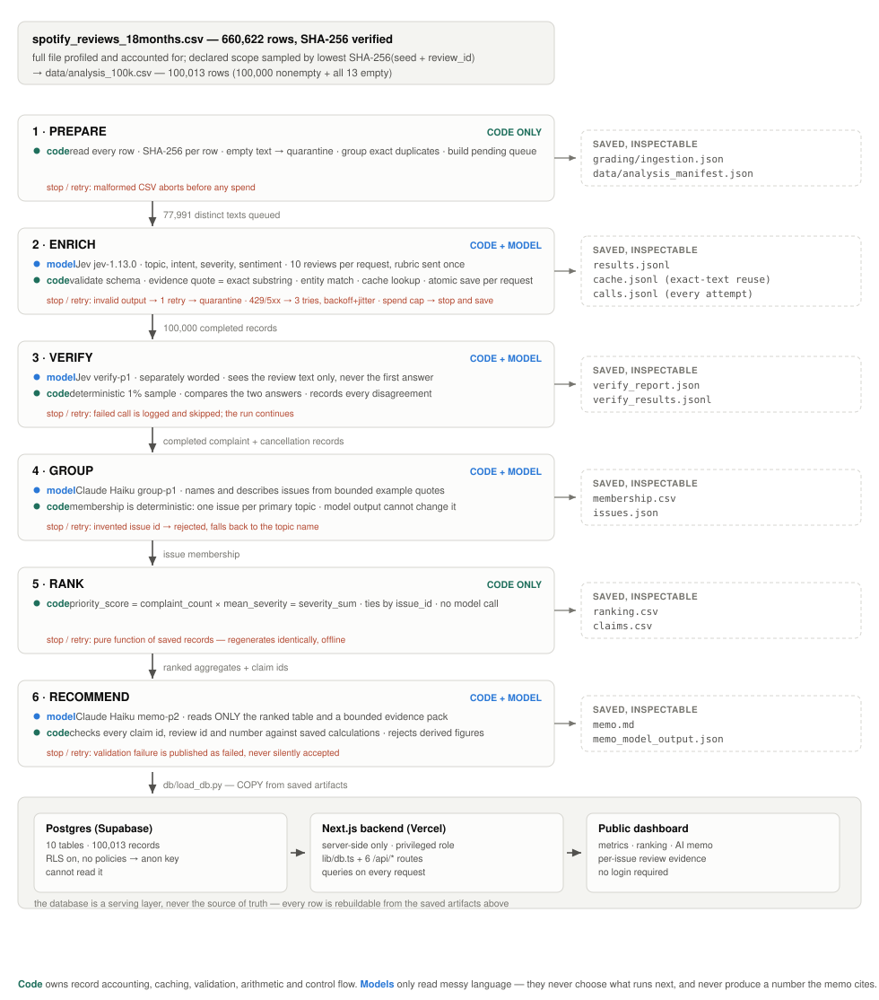

# Spotify Review Insight Pipeline

Turning 100,000 real Spotify Google Play reviews into a product-priority recommendation where every
number traces back to a specific review.

**Live dashboard: https://dashboard-seven-gamma-14.vercel.app** — public, no login required.
**Repo entry point:** this file.

> The dashboard is served by a Next.js backend on Vercel that queries Postgres (Supabase) on every
> request. Verified live: changing a row in the database changed the deployed page's output without a
> redeploy, so this is a real backend reading a real database, not a build-time snapshot.

> **Declared scope.** Assignment v2 requires at least 100,000 reviews. This project classifies a
> deterministic 100,000-review sample (plus all 13 empty-text rows) drawn from the full 660,622-row
> extract. The full file is still ingested, profiled and hashed. The grader's coverage formula divides
> by 660,622/660,609, so this scope earns a proportional coverage score of about **0.32 of 1 point** —
> a deliberate, disclosed trade-off, not an accounting gap. See [Scope and honest limits](#scope-and-honest-limits).

---

## Results at a glance

| | Measured |
|---|---|
| Rows accounted for | **100,013** — 100,000 classified, 13 quarantined (`empty_review_text`), 0 failures |
| Full-file profile | 660,622 rows, 13 empty, 159,701 missing app versions, 0 duplicate IDs — matches `manifest.json` |
| Enrichment cost / time | **$2.23**, 14 min wall clock, 8 workers, 7,800 requests |
| Exact-text reuse | 22,009 records reused from 77,991 distinct texts (verified by the official checker) |
| Golden-set agreement (n=50) | topic **0.90**, intent **0.92**, severity **0.82**, severity MAE **0.26** |
| Independent verifier (n=1,007) | topic **0.915**, intent **0.887**, severity **0.871** |
| Official `check_submission.py` | **`pass`** — zero issues |
| Total API spend, whole project | **$2.61** |

**Top priority: `ISS-usability`** — 12,408 complaints × 2.606383 mean severity = **32,340**.
Full memo: [`runs/main100k/memo.md`](runs/main100k/memo.md).

---

## Rubric map

| Criterion | Evidence |
|---|---|
| **D1** Accessible code & artifacts | This README, [`requirements.txt`](requirements.txt), stdlib-only core, [`.env.example`](.env.example) |
| **D2** Architecture, shared schema, provenance | [Architecture](#architecture), [`pipeline/labels.py`](pipeline/labels.py), [`docs/labels.md`](docs/labels.md), `source_sha256` + `cache_source_id` on every record |
| **D3** Memo numbers linked to calculations | [`grading/claims.csv`](grading/claims.csv), code validation in [`pipeline/memo.py`](pipeline/memo.py) |
| **D2b** One review traced end to end + one failed case | [`docs/trace.md`](docs/trace.md), regenerate with `python3 tools/trace_review.py <id> --md` |
| **D4** Recommendation, alternatives, limitations | [`runs/main100k/memo.md`](runs/main100k/memo.md) |
| **T1** 50 human labels, per-field comparison, error analysis | [`evals/golden_report.md`](evals/golden_report.md) (shipped config), [`evals/golden_report_p1.md`](evals/golden_report_p1.md) (per-review comparison), [`evals/golden_label_changes.md`](evals/golden_label_changes.md) |
| **T2** Independent verification + planted-error/injection tests | [`runs/main100k/verify_report.json`](runs/main100k/verify_report.json), `evals/system_tests/` |
| **T3** Real 100-review cold/warm pilot, calculator, controls | [`cost/report.md`](cost/report.md), [`cost/README.md`](cost/README.md) |
| **W1** Ingestion, coverage, classification | [`grading/ingestion.json`](grading/ingestion.json), self-check `pass` |
| **W2** Staged program, bounded calls, saved handoffs, resume | [`run.py`](run.py), [`tools/resume_demo.sh`](tools/resume_demo.sh), `grading/checkpoint_*.json` |
| **W3** Reproducible ranking + deployed dashboard | [`pipeline/rank.py`](pipeline/rank.py), [`dashboard/`](dashboard/README.md) |

---

## Architecture

<picture>
  <source media="(prefers-color-scheme: dark)" srcset="docs/architecture-dark.svg">
  
</picture>

<sub>Regenerate with `python3 tools/make_architecture_svg.py` — both themes come from one source of truth.</sub>

### Why each model call exists, and what code does instead

| Stage | Why a model is needed | What code does instead / around it |
|---|---|---|
| **Enrich** | Judging topic, intent and severity means reading messy, multilingual, often ungrammatical customer language. No rule set does this. | Code groups duplicate texts, validates the schema, extracts the evidence quote as an exact substring, matches entities by term, applies the contract's severity rules, caches, and saves after every request. |
| **Verify** | Checking a label requires the same language judgment as making one. A second role with different wording gives an independent read. | Code picks the sample deterministically, compares the two answers field by field, and records every disagreement. The model never sees the first answer. |
| **Group (naming)** | Turning a topic bucket into a product-legible issue name needs language judgment. | Code assigns membership deterministically — one issue per primary topic — so ranking never depends on a model, and rejects any issue ID the model invents. |
| **Recommend** | Weighing volume against severity and writing the argument is the one genuinely generative task. | Code computes every number, hands the model only the ranked table and a bounded evidence pack, then validates each cited claim ID, review ID and figure, rejecting derived values like "40% higher". |
| **Prepare / Rank** | **No model.** Counting, hashing, filtering, sorting and arithmetic are deterministic. | Pure code, so the ranking regenerates identically and offline. |

**The division of labour:** the model reads messy language; code owns record accounting, arithmetic,
caching, validation and every number that reaches the memo. Code decides what runs next at every
stage — the model never chooses the control flow.

---

## Efficiency, with measurements

| Technique | What it does | Measured effect |
|---|---|---|
| **Batching (10/request)** | Rubric travels once per request in `state`; 4 short questions per review | **1,732 → 664 input tokens per review (−62%)**; topic and intent agreement identical, severity 0.86 → 0.82 (2 cases of 50) |
| **Exact-text caching** | Keyed on text + model + prompt + schema | 22,009 of 100,000 records reused; warm pilot makes **0** new calls |
| **Work queue + resume** | Pending unique texts drained by a thread pool; completed work skipped on restart | Interrupted at 258 records, resumed to 500, **0** completed IDs re-sent |
| **Parallelism (8 workers)** | Shared spend ledger + shared token-bucket limiter | **2.7× faster at identical cost** on the same 500 reviews, cold both times |

**The one quality cost of batching.** Measured on the same 50 hand-labelled reviews, batching left
topic (0.90) and intent (0.92) agreement untouched but moved severity exact-match from 0.86 to 0.82 —
two cases out of fifty, which 50 cases cannot resolve as a real difference. Both evaluations are
committed ([`evals/golden_report.md`](evals/golden_report.md) for the shipped config,
[`evals/golden_report_p1.md`](evals/golden_report_p1.md) for per-review) so the trade-off is checkable
rather than asserted. The headline numbers in this README are the **shipped** config's.

The parallelism result is worth stating plainly: **more workers buy time, not money.** Cost is driven
by tokens, not wall clock. The speedup was 2.7× rather than 8× because the shared rate limiter — set
to 60% of Jev's published 100K tokens/second — becomes the binding constraint before the API does.

---

## Spending controls

Three independent layers, because one is not enough:

1. **Per-run cap** (`--max-spend`). Worst-case cost is *reserved before* each request; the request is
   refused and the run stops cleanly if spent + reserved + next would exceed the cap.
2. **Project-wide cap** in `state/ledger.json` ($4.00), persisted across every run.
3. **Provider-side**: prepaid credit with auto-recharge disabled.

Plus bounded retries (3 attempts with backoff and jitter for transport/429/5xx; exactly 1 retry for
invalid model output, then quarantine; immediate stop on 401/402/403/422), and timeouts counted at
their full reservation since their true cost is unknown.

---

## Reproduce

```bash
cp .env.example .env            # add TYPESAFE_API_KEY and ANTHROPIC_API_KEY
pip install -r requirements.txt # only the memo stage and DB loader need packages
```

```bash
# No API key, no cost — these are the checks a grader can run
python3 cost/calculator.py                                   # offline cost replay
python3 -c "import sys;sys.path.insert(0,'.');from pipeline.rank import run_downstream;run_downstream('runs/main100k')"
python3 reference/check_submission.py profile --full <path to source csv> --out grading/ingestion.json
```

```bash
# Paid, explicit, capped
python3 run.py enrich --input data/analysis_100k.csv --out runs/main100k --paid --max-spend 3.20 --workers 8 --batch-size 10
python3 cost/calculator.py pilot        # real cold + warm 100-review pilot
bash tools/resume_demo.sh               # interruption and resume evidence
```

Omitting `--paid` makes any enrich command a dry run that prints an estimate and makes no calls.

---

## Scope and honest limits

- **Scope.** 100,000 nonempty reviews sampled by lowest `SHA-256(seed + review_id)`, plus all 13
  empty rows so the quarantine path is exercised. Monthly distribution stays within **0.105
  percentage points** of the full corpus, so trend comparisons remain valid. Rule and checksums:
  [`data/analysis_manifest.json`](data/analysis_manifest.json).
- **Coverage trade-off.** The grader's formula uses full-corpus denominators, so this scope scores
  ~0.32 of the 1 coverage point. Stated here rather than buried.
- **`ISS-other` is a mixed bucket** (14,389 complaints). Grouping by primary topic puts every generic
  complaint here. Splitting it into sub-issues is the clearest next improvement.
- **50 golden cases is a small diagnostic sample**, not a population accuracy estimate. Label
  revisions made after seeing model predictions are disclosed in
  [`evals/golden_label_changes.md`](evals/golden_label_changes.md).
- **What this data cannot support:** no revenue, plan tier, confirmed cancellations, or complete
  customer population. Cancellation language is stated *intent*, never observed churn. No revenue at
  risk and no causal retention claim appears anywhere in the memo — the memo role is instructed
  against it and code rejects derived figures.
- First and last calendar months of the window are partial; the dashboard marks them.

## Security

`.env` is git-ignored and contains the only real credentials. The repo carries a blank
[`.env.example`](.env.example). Database tables have row-level security enabled with no policies, so
the public anon key cannot read them; the dashboard reads server-side with a privileged role supplied
through the hosting environment, never shipped to the browser. Every grader-facing check — offline
cost replay, ranking regeneration, the submission checker — runs with **no credentials at all**.
